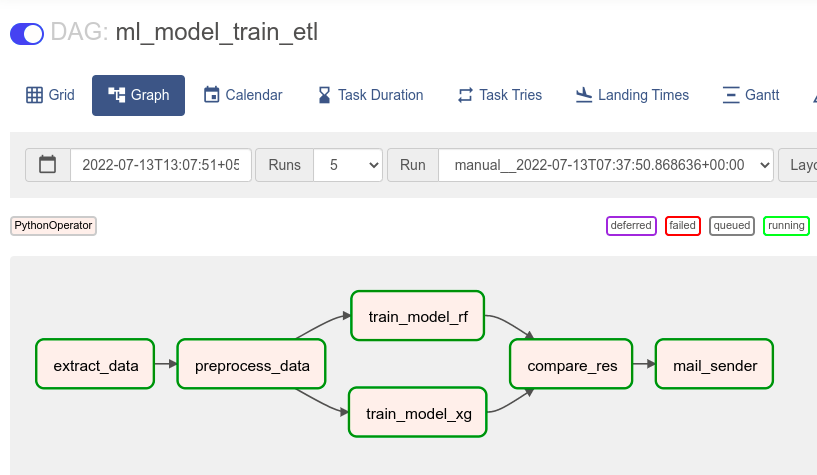

<!-- _class: lead -->
# **Apache Airflow**
#### by **Subhayu Kumar Bala**


---

# **Intro**

## What is it?
Apache Airflow is a platform for programmatically **authoring**, **scheduling**, and **monitoring** workflows. It is completely open source and is especially useful in architecting and orchestrating complex data pipelines. 
Airflow was originally created to **solve the issues that come with long-running cron tasks and hefty scripts**, but it’s since grown to become one of the most powerful open source data pipeline platforms out there.

---

## Why use it?

**Airflow has a couple of key benefits, namely:**

- **It’s dynamic**: Anything you can do in Python, you can do in Airflow.
- **It’s extensible**: Airflow has readily available plugins for interacting with most common external systems. You can also create your own plugins as needed.
- **It’s scalable**: Teams use Airflow to run thousands of different tasks per day.

---

# **Jenkins vs Airflow**

|    Airflow  |    Jenkins    |
|:------------------------------------------------------------------------------------------------------:|:----------------------------------------------------------------------------------------------------------------------------------------------:|
| Airflow is used to monitor and schedule data pipelines using programming languages. | Jenkins enables developers to reliably build, test, and deploy their software. |
| Airflow by all means is a scheduler as it runs after every interval specified by the user. | Jenkins on the other hand works when it gets a trigger, like a push to a specified git repo, etc. |
| Airflow is meant for managing huge production workloads. | Whereas, Jenkins can be used in both testing and production. |

---

# **Project demo**
## Aim

The aim of this small project was to understand the **working principles** of Apache Airflow and also to **demonstrate the capabilities** that it can offer us in **managing Data Science, Machine Learning workloads**.

---

## Implementation



---

At first we create a DAG where the tasks will be run.
```python
with DAG(
    dag_id="ml_model_train_etl",
    schedule_interval="@daily",
    default_args={
        "owner": "airflow",
        "retries": 1,
        "retry_delay": datetime.timedelta(minutes=5),
        "start_date": datetime.datetime(2022, 6, 25)
    },
    catchup=False,
    tags=['mongodb', 'ml', 'etl']) as f:
```

---

Then we define the different steps that needs to evaluated to get the final result.

```python
    extract_data = PythonOperator(
        task_id="extract_data",
        python_callable=extract,
        op_kwargs={
            "SHOP_ID": "5c3c4c07febd2d0001c433f4",
            "connection_url": "mongodb://localhost:27017/"
        }
    )
    preprocess_data = PythonOperator(
        task_id="preprocess_data",
        python_callable=preprocess,
        depends_on_past=True
    )
    ...
```

---

Finally we define the execution flow of the Operators.
```python
extract_data >> preprocess_data 
preprocess_data >> [train_model_xg, train_model_rf]
[train_model_xg, train_model_rf] >> compare_res >> mail_sender
```

---

## Results


---

<!-- _class: lead -->

# Thank You