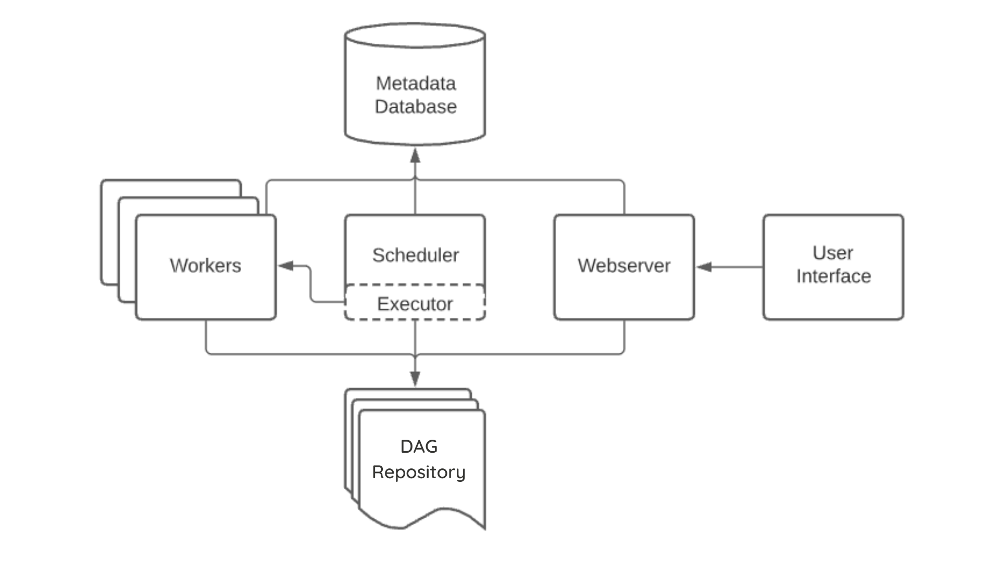

<!-- _class: lead -->
# **Scaling Out** Airflow
#### by **Subhayu Kumar Bala** and **Vipin Katara**

---

## **Why scale Airflow?**

Though Apache Airflow is used for the scheduling and orchestration of data pipelines or workflows, **one of Apache Airflow’s biggest strengths is its ability to scale with good supporting infrastructure**.

---

## **How to scale Airflow?**

Basically, there are two different ways in which we can scale Airflow.

**1**. **Executors** : One of the first choices when using Airflow is the type of executor. The ***executor communicates with the scheduler to allocate resources for each task as they’re queued***.

**2**. **Operators** : Another way to scale Airflow is by using operators to ***execute some tasks remotely***.

---

## Different types of **Executors**
**1**. **LocalExecutor** - The LocalExecutor completes ***tasks in parallel that run on a single machine*** - the same machine that houses the Scheduler and all code necessary to execute.

  - **Pros**
    - It’s straightforward and easy to set up
    - It’s cheap and resource light
    - It still offers parallelism
  - **Cons**
    - It’s not (as) scalable
    - It’s dependent on a single point of failure

---

**2**. **SequentialExecutor** - The Sequential Executor ***runs a single task instance at a time in a linear fashion*** with ***no parallelism*** functionality (A → B → C). It does identify a single point of failure, making it ***helpful for debugging***. Otherwise, the Sequential Executor is not recommended for any use cases that require more than a single task execution at a time.

---

**3**. **CeleryExecutor** - Celery itself is a way of running ***python processes in a distributed fashion***. To optimize for flexibility and availability, the CeleryExecutor ***works with a pool of independent workers*** across which it can delegate tasks, via messages.

  - **Pros**
    - High availability
    - Built for horizontal scaling
    - Worker Termination Grace Period
  
  - **Cons**
    - It takes some work to set up
    - Worker maintenance

---

**4**. **KubernetesExecutor** - KubernetesExecutor relies on a fixed single Pod that dynamically delegates work and resources. For each and every task that needs to run, the Executor talks to the Kubernetes API to dynamically launch Pods which terminate when that task is completed.

  - **Pros**
    - Cost and resource efficient
    - Fault tolerant
    - Task-level configurations

  - **Cons**
    - Kubernetes familiarity as a potential barrier to entry
    - An overhead of a few extra seconds per task for a pod to spin up

---

**5**. **CeleryKubernetes Executor** - The CeleryKubernetesExecutor ***allows users to run simultaneously a CeleryExecutor and a KubernetesExecutor***. An executor is chosen to run a task based on the task’s queue.
CeleryKubernetesExecutor inherits the ***scalability of the CeleryExecutor*** to handle the high load at the peak time and ***runtime isolation of the KubernetesExecutor***.

---

## Why did we use **Celery Executor**?

- When running Celery on top of a managed Kubernetes service, if a node that contains an Celery Worker goes down, Kubernetes will reschedule the work. When the pod comes back up, it’ll reconnect to Redis and continue processing tasks.

- KubernetesExecutor takes time to spin up pod whenever there is a new task, whereas CeleryExecutor doesn't need such procedures, thus reducing time.

---

## Architecture

---

<!-- _class: lead -->
# Thank You