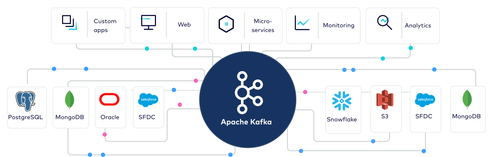
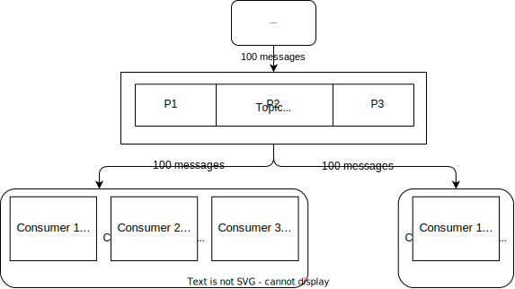

<!-- _class: lead -->
# **Apache Kafka**
#### by **Subhayu Kumar Bala**

---

# What is **Apache Kafka**

Apache Kafka is an **open source distributed streaming system** used for **stream processing**, **real-time data pipelines**, and **data integration at scale**. 

---

## Why use it?

- **Scalable**: Kafka is a distributed system, which can be scaled quickly and easily without incurring any downtime.

- **Fast**: Kafka delivers high throughput for both publishing and subscribing even when dealing with many terabytes of stored messages.

- **Durable**: Kafka persists the messages on the disks, providing intra-cluster replication. This makes for a highly durable messaging system. 

- **Reliable**: Kafka replicates data and is able to automatically balance consumers in the event of failure. 

---

## When to use Kafka?

- To ***publish*** (write) and ***subscribe* to** (read) **streams of events**, including continuous import/export of your data from other systems.
- To **store streams of events** ***durably*** and ***reliably*** for as long as you want.
- To **process streams of events as they occur** or **retrospectively**.
- To use all this functionality in a **distributed**, **highly scalable**, **elastic**, **fault-tolerant**, and **secure** manner.

---

## Partitions

---

## Important Terminologies

- **Producers** are those client applications that publish (write) events to Kafka.
- **Consumers** are those that subscribe to (read and process) these events.
- **Brokers** are just nodes in the cluster hosting the server for storing and transferring data.
- **Topic** is a category/feed name to which records are stored and published.
- **Messages** are key-value pairs containing useful data/record in the value section.

---

## Some common uses:

- To track and monitor cars, trucks, fleets, and shipments in real-time, such as in logistics and the automotive industry.
- To continuously capture and analyze sensor data from IoT devices or other equipment, such as in factories and wind parks.
- To process payments and financial transactions in real-time, such as in stock exchanges, banks, and insurances.
- To serve as the foundation for data platforms, event-driven architectures, and microservices.

---

# **Project demo**
## Aim

The aim of these small projects is to demonstrate how Kafka can be used in two distinct business environments.

1. **Maching Learning**: Where we have a producer, sending train and test data. The consumer processes the data and stores the accuracy and logs.

2. **Real-Time Data Streaming**: Where a producer sends real-time data and the consumer processes and stores the incoming data.

---

<!-- _class: lead -->

# Thank You